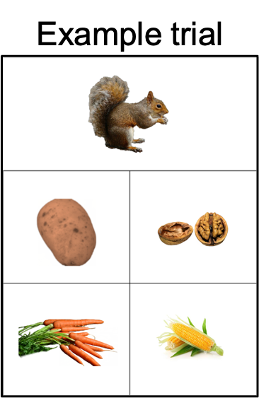
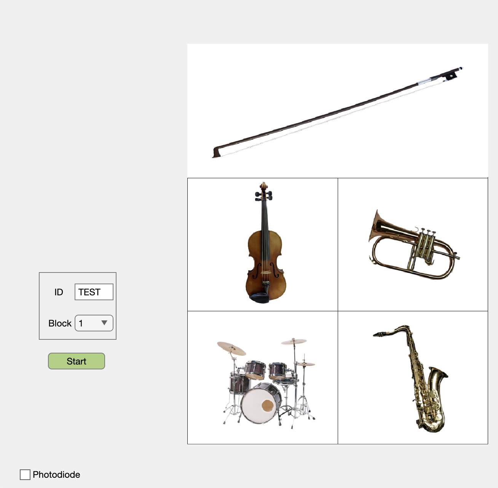
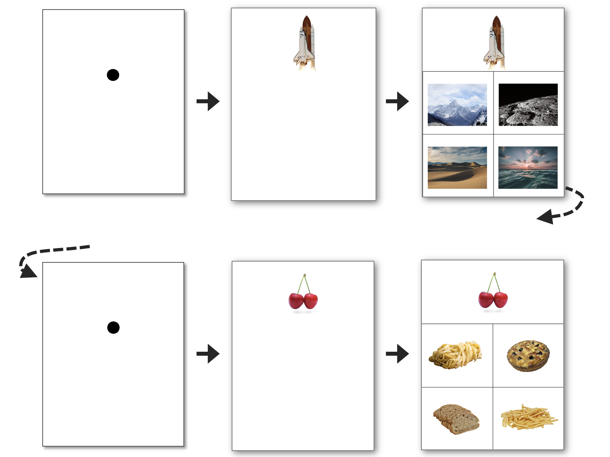

# ViSATUI

Welcome to the repository for the Visual Semantic Association Task (ViSAT).

## Task description

ViSAT is an image-based task that tests the ability to associate the content between images based on factual/general long-term knowledge about them. The ViSAT task specifically targets non-verbal semantic memory. Performing the task does not require any sound, speech, reading, or writing. 

As an example, for most people an image of a squirrel would be most-associated with an image of a nut compared to images of a potato, corn, or carrots. The squirrel image would be called the "stimulus" and the other 4 images would be the "answer" images.

## Task development

The task was adapted from concepts and similar stimuli as the "Pyramids and Palm Trees" (PPT[^1]) and "Camels and Cactus" (CCT[^2]) tasks, yet with a variety of features changed:
1. We used new color and picture images from royalty-free online stock photo repositories (pexels.com, pixabay.com, and unsplash.com).
2. To increase the potential generalizability of ViSAT across participants of all backgrounds (age, language, education, literacy levels, and socioeconomic status), we avoided religious, generation-specific, culture-specific, outdated, and potentially offensive references. 
3. To decrease the possibility of confounding influences from visuospatial processing, we strived to avoid consistencies in color, size, and shape between stimuli and answers. We verified this using a deep learning model assessing image visual features (ResNet-18 and image2vec embedding).
4. Semantic associations can vary between participants based on factors such as personal experiences and backgrounds, therefore there is a possibility that the answer identified by the authors as most-associated with the stimulus would not be percieved as such by the majority of people. To avoid this, instead of deciding amongst ourselves which answer was "correct", we obtained normative data and quantified the proportion of responses for each choice, convening on a “consensus” (top) answer as the “accurate” response. 
5. The percent consensus (PCons) of the top answer can therefore be used as a difficulty metric for statistical modeling if desired. As normative data we also provide the probabilities of each answer choice based on crowdsourced data, which can be used for general interpretation or other statistical modeling, etc. 

## Materials and task delivery

The ViSAT task is delivered by a computer interface in MATLAB which is available at most universities/institutions, sign in here with your institution email: https://www.mathworks.com/login?uri=%2Flicensecenter%2Flicenses%2Fadd%3Fs_tid%3DML_mod_pers_cwl

The software and all stimuli are included in this public repository.

A PDF of the individual trials (for manual/printable/paper delivery if desired) is in the "ViSAT_images" folder: https://github.com/Kleen-Lab/ViSATUI/tree/main/ViSAT_images
- ViSAT_Official_TrialsPractice.pdf: Three practice trials
- ViSAT_Official_Trials1-100.pdf: Full set of 100 trials (4 blocks of 25 difficulty-balanced trials)

## User interface

There are three phases for each trial:
1. A fixation dot is displayed in the center of the screen for 2 to 3 seconds (duration randomly jittered).
2. The stimulus image is displayed, and the subject is required to click on it
3. The four answer choices are displayed, and the subject is required to click on the image that is most associated with the stimulus image

There are four blocks of 25 trials each, for a total of 100 trials. 
Each block begins with the same three "practice trials" (not scored) to allow for acclimation prior to the actual set of 25 trials. 
Blocks are balanced in terms of difficulty (similar average trial PCons), and thus can be done at different timepoints for longitudinal comparison.

## Administering the task

To administer the task, you need to:
- Dowload the current folder, either by cloning the repository or by downloading the zip archive of the folder and extracting it to your desired location.
- Open the User Interface by either entering `ViSATUI` into the Command Window, or by double-clicking on the `ViSATUI.mlapp` file that is included in the folder.
- Enter the `User ID` of the subject that will be performing the task. This `ID` is important, since all data resulting from the task will be saved in a folder named after that `ID`, e.g. `ViSATUI/test_id/`. Make sure to enter the same `ID` for all the blocks that the subject performs.
- Have the subject start the task on the computer. They can perform different blocks in different sittings (i.e. over time or longitudinally), or do multiple in a row. As long as the `ID` stays consistent, you can even close the software in between sessions.
- You can find the resulting data in the `ViSATUI/ID` folders that are created for each subject `ID`.

## Behavioral metrics

Behavioral metrics provided by the user interface:
1. Response time for clicking the stimulus (no semantic processing requirement)
2. Response time for clicking the answer (semantic processing required)
3. Accuracy (whether consensus/most common answer was chosen)

Data format:
Each block is saved in a .mat file (e.g. subject1_set1.mat) which contains information about the block, and the performance metrics above as the following variables:
- `DurationsFixStimAns` contains the durations (in seconds, to microsecond decimal precision) of the Fixation, Stimulus, and Answer phases, in seconds. It is a matrix of 3 columns and 28 rows (1:3 = practice trials, 4-28 are the 25 trials for that block)
- `userAnswers` contains the specific answer image choice clicked by the subject for each trial (A=top left answer, B=top right, C=bottom left, D=bottom right). It is a vector of 1 column and 28 rows (1:3 = practice trials, 4-28 are the 25 trials for that block)

## Tips

Here are a few tips to make the administration of the task as easy as possible: 
- Emphasize to the the subject beforehand that they must pick the answer that is most-associated with the stimulus, using their general knowledge about those objects instead of the color, shape, texture, or other visual features of the objects. 
- Behavioral timelocking with neural data amplifiers (for example, EEG experiments) can be done using a photodiode analog input. A photodiode option is available on the UI (checkbox located on the lower left) which enables grey-scale light transitions at top left that can be tracked with a screen-mounted photodiode.

## Cite
The scientific manuscript describing the ViSAT task is currently in press; upon publication the direct citation will be listed here.

### References
[^1]: Howard, D. (1992). The Pyramids and Palm Trees Test: A Test of Semantic Access from Words and Pictures. Thames Valley Test Company.
[^2]: Moore et al. (2022). A modified Camel and Cactus Test detects presymptomatic semantic impairment in genetic frontotemporal dementia within the GENFI cohort. Applied Neuropsychology. Adult, 29(1), 112–119.
