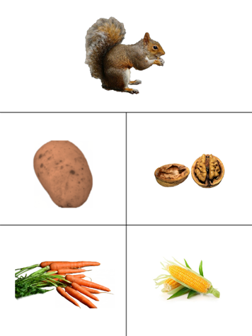
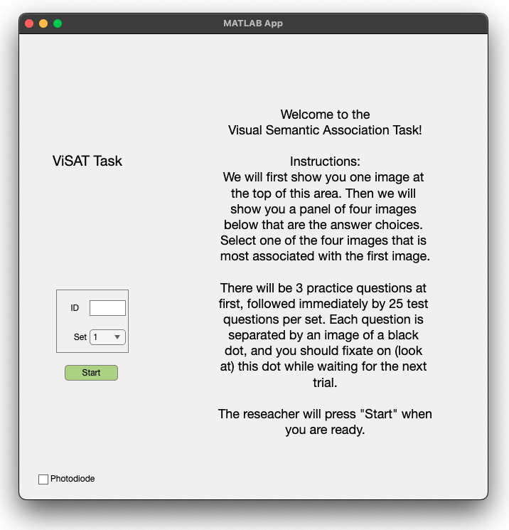

# ViSATUI

Welcome to the repository for the Visual Semantic Association Task (ViSAT).

Please cite the following paper in your publications if you have used our software in your research: 
Tran EB, Vonk JMJ, Casaletto K, Zhang D, Christin R, Marathe S, Gorno-Tempini ML, Chang EF, Kleen JK. Development and validation of a nonverbal consensus-based semantic memory paradigm in patients with epilepsy. "Development and validation of a nonverbal consensus-based semantic memory paradigm in patients with epilepsy." Journal International Neuropsychological Society. 2024 Apr 15:1-9. [https://doi.org/10.1017/S1355617724000158](https://doi.org/10.1017/S1355617724000158)

ViSAT is licensed for non-commercial research use at no cost by the Regents of the University of California under CC BY-NC-SA 4.0 (https://creativecommons.org/licenses/by-nc-sa/4.0/).
The following copyright notice and citation is to be included in any publication, material or media wherein all or a part of Licensed Material is contained, “Certain materials incorporated herein are Copyright © 2024 The Regents of the University of California (REGENTS). All Rights Reserved.  

## Task description

ViSAT is an image-based task that tests the ability to associate the content between images based on factual/general long-term knowledge about them. The ViSAT task specifically targets non-verbal semantic memory. Performing the task does not require any sound, speech, reading, or writing. 

As an example, for most people, an image of a squirrel would be most-associated with an image of a nut compared to images of a potato, corn, or carrots. The squirrel image would be called the "stimulus" and the other 4 images would be the "answer" images.

## Task development

The task was adapted from concepts and similar stimuli as the "Pyramids and Palm Trees" (PPT[^1]) and "Camels and Cactus" (CCT[^2]) tasks, yet with a variety of features changed:
1. We used new color and picture images from royalty-free online stock photo repositories (pexels.com, pixabay.com, and unsplash.com).
2. To increase the potential generalizability of ViSAT across participants of all backgrounds (age, language, education, literacy levels, and socioeconomic status), we avoided religious, generation-specific, culture-specific, outdated, and potentially offensive references. 
3. To decrease the possibility of confounding influences from visuospatial processing, we strived to avoid consistencies in color, size, and shape between stimuli and answers. We verified this using a deep learning model assessing image visual features (ResNet-18 and image2vec embedding).
4. Semantic associations can vary between participants based on factors such as personal experiences and backgrounds, therefore there is a possibility that the answer identified by the authors as most-associated with the stimulus would not be percieved as such by the majority of people. To avoid this, instead of deciding amongst ourselves which answer was "correct", we obtained normative data and quantified the proportion of responses for each choice, convening on a “consensus” (top) answer as the “accurate” response. 
5. The percent consensus (PCons) of the top answer can therefore be used as a difficulty metric for statistical modeling if desired. As normative data we also provide the probabilities of each answer choice based on crowdsourced data, which can be used for general interpretation or other statistical modeling, etc. 

## Materials and task delivery

The ViSAT task is delivered by a computer interface in MATLAB which is available at most universities/institutions, you can sign in [here](https://www.mathworks.com/login?uri=%2Flicensecenter%2Flicenses%2Fadd%3Fs_tid%3DML_mod_pers_cwl) with your institution email.

The software and all stimuli are included in this public repository.

A PDF of the individual trials (for manual/printable/paper delivery if desired) is in the [`ViSAT_images`](https://github.com/Kleen-Lab/ViSATUI/tree/main/ViSAT_images) folder.
- ViSAT_Official_TrialsPractice.pdf: 3 practice trials
- ViSAT_Official_Trials1-100.pdf: 100 total trials (4 sets of 25 difficulty-balanced trials)

## User interface

There are three phases for each trial:
1. A fixation dot is displayed in the center of the screen for 2 to 3 seconds (duration randomly jittered).
2. The stimulus image is displayed, and the subject is required to click on it
3. The four answer choices are displayed, and the subject is required to click on the image that is most associated with the stimulus image

There are four sets of 25 trials each, for a total of 100 trials. 
Each set begins with the same three "practice trials" (not scored) to allow for acclimation prior to the actual set of 25 trials. 
Sets are balanced in terms of difficulty (similar average trial PCons), and thus can be done at different timepoints for longitudinal comparison.

## Administering the task

To administer the task, you need to:
- Dowload the current folder (~127mb, due to picture stimuli), either by cloning the repository or by downloading the zip archive of the folder and extracting it to your desired location.
- Open the User Interface by either entering `ViSATUI` into the MATLAB Command Window, or by double-clicking on the `ViSATUI.mlapp` file that is included in the folder.
- Enter the `ID` of the subject that will be performing the task. This `ID` is important, since all data resulting from the task will be saved in a folder named after that `ID`, e.g. `ViSATUI/test_id/`. Make sure to enter the same `ID` for all the sets that the subject performs.
- Have the subject start the task on the computer. They can perform different sets in different sittings (i.e. over time or longitudinally), or do multiple in a row. As long as the `ID` stays consistent, you can even close the software in between sessions.
- You can find the resulting data in the `ViSATUI/ID` folders that are created for each subject `ID`.

## Behavioral metrics

Behavioral metrics provided by the user interface:
1. Response time for clicking the stimulus (no semantic processing requirement)
2. Response time for clicking the answer (semantic processing required)
3. Accuracy (whether consensus/most common answer was chosen)

Data formats:
The trial-by-trial results/data from each set are saved in a .csv file (spreadsheet, e.g. set1.csv), and also in a .mat file (e.g. set1.mat) in the ViSATUI folder. These two file formats are for convenience, and they contain information about the set along with the performance metrics above.

*MAT files (MATLAB)*
- `DurationsFixStimAns` contains the durations (in seconds, to microsecond decimal precision) of the Fixation, Stimulus, and Answer phases, in seconds. It is a matrix of 3 columns and 28 rows (1:3 = practice trials, 4-28 are the 25 trials for that set)
- `userAnswers` contains the specific answer image choice clicked by the subject for each trial (A=top left answer, B=top right, C=bottom left, D=bottom right). It is a vector of 1 column and 28 rows (1:3 = practice trials, 4-28 are the 25 trials for that set)

*CSV files (any spreadsheet viewer)*
The .csv file outputs only actual trials. Practice trials are ignored, as they are not incorporated in the scoring of performance. Information including PCons for the participant's answer and for the consensus (PCons) answer are provided, along with response times for both stimulus and the answer stages. More details on the different data columns are below:
- `trial_id`, integer. Ranges from 1-100, trials 1-25 are in set 1, 26-50 are in set 2, 51-75 are in set 3, and 76-100 are in set 4.
- `answer`, char. Patient answer, ranges from 'A'-'D'.
- `consensus_answer`, char. Consensus answer identified through normative testing for this trial. Used as the "correct" answer. Ranges from 'A'-'D'.
- `correct`, boolean. 1 if the answer is correct as identified by the consensus answer, 0 if not.
- `pcons_answer`, float. Percent consensus for the answer given by the patient, as identified through the answers of normative testers. Ranges from 0-100.
- `pcons_consensus_answer`, float. Percent consensus for the consensus answer, as identified throught the answers of normative testers. Can be used as a measure of trial difficulty. Ranges from 0-100.
- `stimulus_response_time`, float. Time interval between when the stimulus is presented and when the patient clicks on the stimulus image.
- `answer_response_time`, float. Time interval between when the answers are presented and when the patient clicks on their chosen answer.

*SUMMARY OF RESULTS and normative data comparisons*--
An additional summary .csv file called "Overall.csv" is saved in the same folder. This provides the summary of results for each set run including raw and perecentile accuracies and response times. Any sets that have not been run yet will show "NaN" in this file, until they are run for your participant. More details on the different data columns are below:
- `trial_set`, string. Represents each of the 4 sets as well as all of them combined ("set1"-"set4", "all_sets").
- `accuracy`, float. Accuracy of the patient on that set, using the consensus of normative testers as the "correct" answer.
- `accuracy_percentile`, float. Percentile of the accuracy when compared to our population of healthy controls.
- `stimulus_response_time`, float. Average response time to the stimulus.
- `stimulus_response_time_percentile`, float. Percentile of the stimulus response time when compared to our population of healthy controls.
- `answer_response_time`, float. Average response time to the answer.
- `answer_response_time_percentile`, float. Percentile of the answer response time when compared to our population of healthy controls.

## Tips

Here are a few tips to make the administration of the task as easy as possible: 
- Emphasize to the the subject beforehand that they must pick the answer that is most-associated with the stimulus, using their general knowledge about those objects instead of the color, shape, texture, or other visual features of the objects. 
- Behavioral timelocking with neural data amplifiers (for example, EEG experiments) can be done using a photodiode analog input. A photodiode option is available on the UI (checkbox located on the lower left) which enables grey-scale light transitions at top left that can be tracked with a screen-mounted photodiode.

## Cite
If you end up using this package in your research, please cite the following paper: 

Tran EB, Vonk JMJ, Casaletto K, et al. Development and validation of a nonverbal consensus-based semantic memory paradigm in patients with epilepsy. *Journal of the International Neuropsychological Society*. Published online 2024:1-9. doi:10.1017/S1355617724000158

### References
[^1]: Howard, D. (1992). The Pyramids and Palm Trees Test: A Test of Semantic Access from Words and Pictures. Thames Valley Test Company.
[^2]: Moore et al. (2022). A modified Camel and Cactus Test detects presymptomatic semantic impairment in genetic frontotemporal dementia within the GENFI cohort. Applied Neuropsychology. Adult, 29(1), 112–119.
